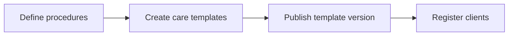

# Navigation

Clinic shell (`components/clinic/clinic-shell.tsx`) provides sidebar/drawer navigation across all `/clinic/*` routes.

# Setup Workflow

1. **Procedures** — catalog of procedure types (`/clinic/procedures`).
2. **Templates** — draft days/tasks/symptom options/alert rules; publish creates immutable version (`/clinic/templates`).
3. **Clients** — tenant-safe client records with masked phone (`/clinic/clients`).

Rules: published template content cannot be silently edited; archived clients cannot receive new plans.

# Care Delivery Workflow

1. **Care plan** — snapshot from a published template version (`/clinic/plans/new`).
2. **Secure link** — create/rotate/revoke; plaintext token shown once (`lib/secure-links/`).
3. **Monitoring** — task completion history on plan detail; alerts from portal check-ins (`/clinic/alerts`).

# Alert Review Workflow

1. Portal submits structured check-in with severity (1–5).
2. Deterministic rule engine evaluates plan-specific alert rules (`lib/check-ins/`).
3. Clinic staff acknowledge, resolve, or dismiss (`/clinic/alerts/[id]`).
4. All transitions append to `alert_events`.

The system does not diagnose — alerts mean clinic review is needed.

# Photo Workflow

1. Staff creates `photo_requests` on a care plan (owner/admin: `photo.request.manage`).
2. Portal uploads via intent → signed upload → server finalize (Sharp, WebP, metadata strip).
3. Staff views via short-lived signed URL (`/clinic/photos/[id]/view-url`) after authorization RPC.
4. Orphan cleanup via protected internal job (dry-run default).

See [Media Modules](../modules/media-modules.md) and [ADR 0002](../adr/0002-photo-storage-foundation.md).

# Consent and Data Request Workflow (Faz 8)

1. **Document management** — owner/admin create drafts, publish immutable versions (`/clinic/consent-documents`).
2. **Client assignment** — assign published document versions on client detail page (`/clinic/clients/[id]`).
3. **Portal decisions** — patient acknowledges notices, accepts/declines/withdraws consent via portal.
4. **Data request review** — staff review submitted requests, assign reviewers, transition status (`/clinic/data-requests`).

Staff have read-only access to consent assignments and data requests; manage actions require owner/admin.

See [Compliance Modules](../modules/compliance-modules.md) and [ADR 0003](../adr/0003-consent-data-request-foundation.md).

# Related

- [Application Routes](application-routes.md)
- [Clinical Modules](../modules/clinical-modules.md)
