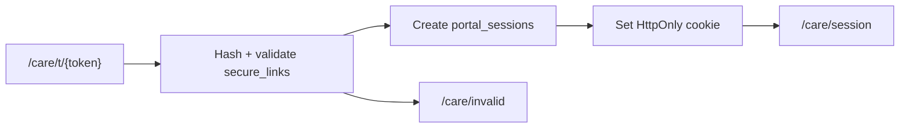

# Entry: Secure Link Exchange

1. Patient receives plaintext token (shown once at link create/rotate).
2. `app/care/t/[token]/route.ts` hashes token with pepper, validates link row.
3. Server creates `portal_sessions` record and sets cookie `aftercare_portal_session`.
4. Cookie scope: path `/care`, short TTL (~15 minutes), HttpOnly.
5. Invalid/expired/revoked links redirect to `/care/invalid`.

Reloading the token URL after exchange does not re-display the plaintext token.

# Session Capabilities

All operations go through session-scoped RPCs in `lib/portal/service.ts`:

| Capability | Route | Module |
|------------|-------|--------|
| View plan days/tasks | `/care/session` | `lib/portal/` |
| Complete/reopen tasks | `POST /care/session/tasks` | `lib/portal/actions.ts` |
| Structured check-in | `POST /care/session/check-in` | `lib/check-ins/` |
| Photo upload | `POST .../photos/intents`, `.../finalize` | `lib/photos/client-upload.ts` |
| Document decisions | `POST /care/session/documents` | `lib/consent/portal-service.ts` |
| Data request submit | `POST /care/session/data-requests` | `lib/data-requests/portal-service.ts` |

# Privacy Rules

Portal responses and DTOs **exclude**:

- Phone numbers, email addresses
- Internal database IDs exposed to browser
- Token hashes, session hashes
- Clinic internal notes
- Raw storage paths or signed URLs (except ephemeral upload credential in component memory)

Document body renders as **plain text** — no `dangerouslySetInnerHTML`.

# Consent Portal Behavior

- Notice acknowledgment (`notice_acknowledged`) is separate from consent.
- Consent events: `consent_accepted`, `consent_declined`, `consent_withdrawn` — all append-only.
- Accept and decline are equally available in UI.
- Withdrawal does not delete data, photos, or prior events.
- Archived document assignments are hidden from portal in Faz 8.3B.

# Data Request Portal Behavior

- Submission creates a `submitted` workflow record and matching event.
- No automatic export, correction, deletion, or restriction actions.
- Portal lists only requests it owns for the session scope.

# Rate Limiting

Secure-link token exchange (`/care/t/[token]`) and portal task mutations (`/care/session/tasks`) use a durable PostgreSQL-backed shared limiter with opaque HMAC-derived keys (`RATE_LIMIT_PEPPER`). Process-local counters are not used on these routes. Store failures fail closed with generic responses. Expired bucket cleanup exists as a server-only helper but is not wired to production cron in Faz 9A Stage 1.

# Related

- [Auth and Roles](auth-and-roles.md) — portal vs clinic auth
- [Portal Modules](../modules/portal-modules.md)
- [Compliance Modules](../modules/compliance-modules.md)
