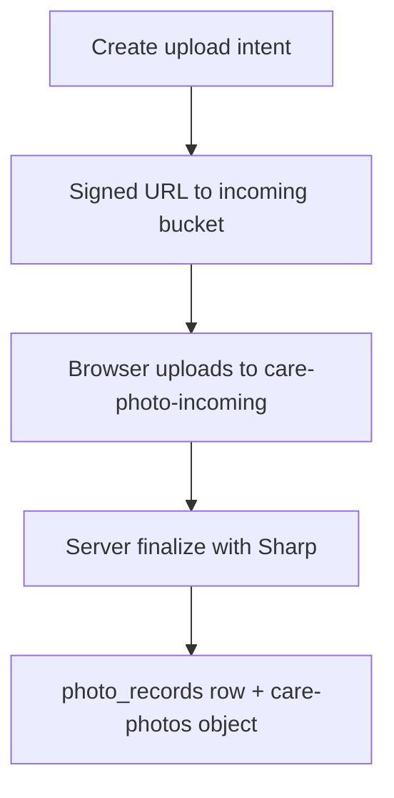

# Module Inventory

| Module | Path | Responsibility |
|--------|------|----------------|
| Photos core | `lib/photos/` | Intents, finalize, storage, clinic view, image processing |
| Photo cleanup | `lib/photos/cleanup/` | Orphan classification, dry-run/execute job |

# Upload Architecture (Staged)

1. Portal session validates plan/day/photo request scope.
2. Server creates short-lived `photo_upload_intents` row.
3. Browser receives signed upload URL for opaque key in `care-photo-incoming`.
4. Finalize claims intent, validates bytes, strips metadata, writes WebP to `care-photos`.
5. Only finalized output creates `photo_records`.

# Key Files

| File | Role |
|------|------|
| `client-upload.ts` | Portal intent creation |
| `finalize.ts` | Atomic claim, Sharp processing, idempotent finalize |
| `image-processing.ts` | Decode validation, orientation, EXIF strip, WebP output |
| `clinic-view.ts` | Authorization RPC + short-lived signed view URL |
| `storage.ts` | Bucket operations |
| `keys.ts` | Opaque key generation |
| `cleanup/job.ts` | Orphan cleanup with advisory lock |

# Security Rules

- Accepted types: JPEG, PNG, WebP — max 5 MB.
- Object keys are opaque — no org/plan/client IDs or filenames.
- Signed upload token stays in component memory only — never persisted.
- Clinic viewer never receives raw storage key or bucket path.
- Audit metadata never includes storage paths, signed URLs, or filenames.

# Cleanup (`lib/photos/cleanup/`)

| Mode | Command |
|------|---------|
| Dry run | `npm run photo:cleanup:dry-run` |
| Execute | `npm run photo:cleanup:execute` |
| HTTP job | `POST /internal/jobs/photo-cleanup` with `PHOTO_CLEANUP_SECRET` |

Conservative rules: if orphan status uncertain, do not delete. Referenced finalized photos are never deleted.

# Related

- [ADR 0002](../adr/0002-photo-storage-foundation.md)
- [Schema by Phase](../tables/schema-by-phase.md) — Faz 7 tables
